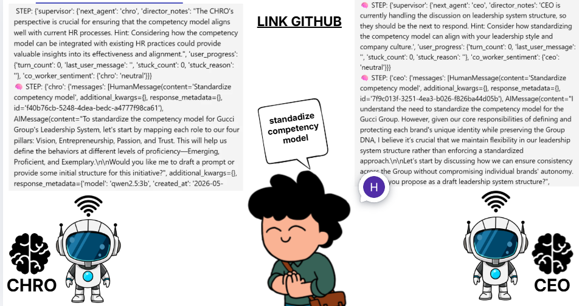

AI Co-Worker Engine
===================

Multi-agent AI simulation backend for job-role training and leadership scenarios.
Built with FastAPI + LangGraph and designed to run local models via Ollama.

Features
--------
- Multi-agent simulation (CEO, CHRO, Regional) with supervisor routing.
- Tooling stubs for KPI, A/B, prompt library, and portfolio exports.
- Lightweight safety post-check flags in API response.
- Persistent memory and document retrieval via ChromaDB.

Tech Stack
----------
- FastAPI
- LangGraph / LangChain
- Ollama (local LLMs)
- ChromaDB

Project Structure
-----------------
- app/agents/: persona agents, supervisor, tools
- app/core/: LLM provider, prompts, state schema
- app/memory/: ChromaDB vector store
- app/utils/: safety post-check
- main.py: FastAPI entrypoint

Requirements
------------
- Python 3.10+ recommended
- Ollama installed and running for local models

Setup (Windows)
---------------
```bash
python -m venv venv
venv\Scripts\Activate.ps1
pip install -r requirements.txt
```

Local Model (Ollama)
--------------------
Pick the local model in app/core/llm.py. Example for low RAM:

```python
model=model_name or "qwen2.5:3b"
```

Make sure the model exists in Ollama:

```bash
ollama pull qwen2.5:3b
```

Run the API
-----------
```bash
python main.py
```

Or via Uvicorn:

```bash
uvicorn main:app --reload --host 0.0.0.0 --port 8000
```

API Endpoints
-------------
- GET /health
- POST /chat
- GET /simulations/{simulation_id}/threads/{thread_id}

Example Request
---------------
```bash
curl -X POST http://localhost:8000/chat \
	-H "Content-Type: application/json" \
	-d "{\"message\":\"Hello\",\"current_module\":1,\"model_type\":\"local\",\"enable_ceo\":true,\"enable_chro\":true,\"enable_regional\":true}"
```

Response includes safety flags:
- draft_language_present
- source_confirmation_present
- wagering_language_detected
- compliant

Troubleshooting
---------------
1) TypeError: create_react_agent() got unexpected keyword arguments: state_modifier
	 - Your langgraph version is older. Upgrade:
		 pip install -U langgraph
	 - Or change state_modifier to prompt in app/agents/base_agent.py.

2) Ollama connection errors
	 - Ensure `ollama serve` is running and the model is pulled.

Notes
-----
- Chroma data persists to ./chroma_db.
- The default supervisor model is set in app/agents/supervisor.py.

License
-------
TBD
