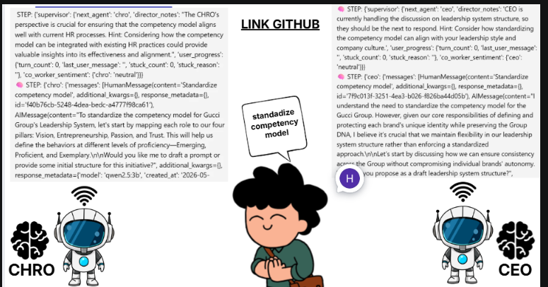

# 🤖 AI Co-Worker Engine - Project Documentation

## Executive Summary

**AI Co-Worker Engine** is a production-grade multi-agent simulation platform for job-role training and leadership development. It orchestrates realistic NPC interactions in business scenarios using local LLMs, dynamic emotional state management, memory persistence, and stage-driven progression.

**Key Achievement**: Transforms static training into adaptive, multi-voice organizational simulations where NPCs push back, remember context, and evolve emotionally based on user input.

---

## Architecture Overview

### Core Components

```
┌─────────────────────────────────────────────────┐
│  Gradio UI (127.0.0.1:7860)                     │
│  - Chat interface                               │
│  - Stage view & diagnostics                     │
│  - Emotion tracking                             │
└──────────────────┬──────────────────────────────┘
                   │ HTTP
┌──────────────────▼──────────────────────────────┐
│  FastAPI Backend (main.py - port 8000)          │
│  - /chat endpoint: orchestrates turns           │
│  - State hydration from checkpoint              │
│  - Memory persistence                           │
└──────────────────┬──────────────────────────────┘
                   │
      ┌────────────┴────────────┐
      │                         │
      ▼                         ▼
┌─────────────────┐    ┌──────────────────┐
│  LangGraph      │    │  Ollama LLM      │
│  Orchestration  │◄──►│  (qwen2.5:3b)    │
│  (app/graph.py) │    │  Local inference │
└─────────────────┘    └──────────────────┘
      │
      ├─ Supervisor node (routing)
      ├─ CEO/CHRO/Regional agents
      ├─ Tool node (gating)
      └─ State checkpointing (MemorySaver)
```

### Technology Stack

| Component | Purpose | Tech |
|-----------|---------|------|
| Backend | API & orchestration | FastAPI + LangGraph |
| LLM Provider | Local inference | Ollama qwen2.5:3b |
| State Mgmt | Session continuity | LangGraph MemorySaver |
| UI | User interaction | Gradio |
| Config | Simulation rules | JSON (simulations/{id}/config.json) |

---

## Key Features & Implementation

### 1. Multi-Agent Orchestration (Supervisor-First Routing)

**Architecture**: Supervisor → Route Decision → Agent Wrapper → Response → Checkpoint

**Components**:
- **Supervisor Node** (`app/agents/supervisor.py`): Decides next agent based on:
  - User input analysis (intent detection)
  - Stage guidance (soft preference, not hard override)
  - Framework loop detection (repeated topics)
  - Stuck detection (repeated intent or confusion signals)
  - Agent enablement (respects enabled_coworkers flags)

- **Routing Logic** (`app/graph.py`):
  ```python
  # Voice diversity: Auto-route Regional if CHRO just spoke
  if next_agent == "chro" and last_agent == "chro" and regional_enabled:
      next_agent = "regional"
  ```

**Key Decision**: Supervisor's LLM choice is respected unless agent is disabled. Stage preference only applies as fallback.

### 2. Distinct NPC Personas

**Three Agent Voices** (all in `app/core/prompts.py`):

| Agent | Role | Personality | Pushback Style |
|-------|------|-----------|---|
| **CEO** | Strategy | Business-first, brand-protective, impatient with vague proposals | Challenges scope creep, demands clarity |
| **CHRO** | People/Org | Coaching-oriented, process-driven, pragmatic | Acknowledges tradeoffs, asks "how will we execute?" |
| **Regional** | Operations | Practical, skeptical, protective of local autonomy | Points out implementation risks, localization barriers |

**Implementation** (`app/agents/base_agent.py`):
```python
system_prompt = f"""{persona}
Do not default to agreement. When idea is incomplete/overly broad/risky, push back constructively.
Include business tension when relevant: risk, resistance, brand autonomy, local adaptation.
Avoid boilerplate openers (Certainly, Absolutely, Of course).
Lead with domain-specific judgment this role would naturally care about."""
```

### 3. Emotional State Evolution

**States**: `collaborative`, `skeptical`, `defensive`, `impatient`, `neutral`

**How it Changes**:
- Framework loop detected (topic repeated 2+ times) → Next agent: `skeptical` or `defensive`
- User stuck (repeated intent) → Next agent: `impatient`
- Director event triggered (adoption resistance) → Speaker agent: `defensive`
- Fresh topic → Agent: `collaborative`

**Effect on Output** (via prompt injection):
```
SKEPTICAL: "Challenge assumptions, max 200 words, ask for evidence"
DEFENSIVE: "Protect constraints firmly, max 150 words, say no clearly"
IMPATIENT: "Max 1-2 sentences, ask ONE hard question"
COLLABORATIVE: "Up to 300 words, be thorough and supportive"
```

**Updated After Each Response**:
```python
# Infer emotion from agent's own text
next_emotion = _infer_emotion_from_text(agent_output_text, current_emotion)
sentiment[agent_name] = next_emotion
```

### 4. Memory Persistence Across Turns

**State Checkpoint Management** (`main.py`):
```python
# CRITICAL: Hydrate state before invoke
snapshot = simulation_graph.get_state(config)
previous_state = snapshot.values if snapshot else {}

# Merge with new input (seed only missing fields)
inputs["co_worker_sentiment"] = previous_state.get("co_worker_sentiment", {})
inputs["coworker_memory"] = previous_state.get("coworker_memory", {})
inputs["user_progress"] = previous_state.get("user_progress", {})
# ... invoke graph ...
# State automatically checkpointed via MemorySaver
```

**Persisted Fields**:
- `messages`: Full conversation history
- `co_worker_sentiment`: Per-agent emotional state
- `coworker_memory`: Latest agent stances + shared context
- `user_progress`: Turn count, stuck status
- `director_event`: Current organizational pressure
- `simulation_stage`: Current workflow stage
- `completed_deliverables`: Progress tracking

### 5. Director Events (Scenario Manipulation)

**Trigger**: Framework loop detected (topic repeated 2+ times)

**Event Structure**:
```json
{
  "speaker": "regional",
  "message": "Regional offices are pushing back. Framework too centralized.",
  "hidden_objective": "Force user to address adoption resistance",
  "pressure_type": "resistance"
}
```

**Effect**: Injected as AIMessage before agent invokes, creates organizational realism.

### 6. Deliverable Detection & Stage Progression

**Config-Driven** (`simulations/gucci-leadership-08/config.json`):
```json
{
  "stages": [
    {
      "name": "discovery",
      "required_deliverables": ["problem_statement"],
      "preferred_agents": ["chro", "ceo"]
    },
    {
      "name": "alignment",
      "required_deliverables": ["group_dna", "competency_matrix"],
      "preferred_agents": ["ceo", "chro"]
    }
    // ... more stages
  ],
  "deliverables": [
    {
      "id": "problem_statement",
      "keywords": ["problem", "challenge", "can't move", "different model", ...]
    }
    // ... more deliverables
  ]
}
```

**Detection Algorithm** (`supervisor.py` - `_deliverable_confidence`):
- **Keyword matching** (55%): Multi-word/single-word/phrase matching
- **Intent signal** (20%): Presence of action patterns (define, map, propose, design, etc.)
- **Structure signal** (15%): Presence of lists, formatting
- **Detail signal** (10%): Min 20 tokens + context markers

**Thresholds**:
- Required deliverable: 0.60 (easier to hit, drives progression)
- Optional: 0.85

**Auto-Progression**: When all required deliverables met → stage advances automatically.

### 7. Inter-Agent Awareness (Coworker Memory)

**Structure**:
```python
coworker_memory = {
  "latest_stances": {
    "chro": "I appreciate your suggestion... However, important to consider brand autonomy",
    "regional": "Concerned about centralized approach... localization challenges"
  },
  "last_agent": "regional",
  "last_summary": "..."
}
```

**Injection** (graph.py):
```python
def _build_peer_context(coworker_memory, current_agent):
    # Format prior agent positions
    # Return as SystemMessage for next agent
    return "Shared coworker memory:\n- CEO: {...}\n- CHRO: {...}"
```

**Effect**: Agents see what others said and react instead of answering in isolation.

---

## System Requirements & Setup

### Prerequisites
- **Python**: 3.10+
- **Ollama**: Running locally with qwen2.5:3b model pulled
- **RAM**: 4GB+ (for local LLM + API)
- **OS**: Windows/Mac/Linux

### Windows Setup

```bash
# 1. Create virtual environment
python -m venv venv
venv\Scripts\Activate.ps1

# 2. Install dependencies
pip install -r requirements.txt

# 3. Pull Ollama model
ollama pull qwen2.5:3b

# 4. Start Ollama (in separate terminal)
ollama serve

# 5. Run FastAPI backend (terminal A)
python -m uvicorn main:app --reload --host 0.0.0.0 --port 8000

# 6. Run Gradio UI (terminal B)
python gradio_app.py
```

### Configuration

**LLM Settings** (`app/core/llm.py`):
```python
model_name = "qwen2.5:3b"  # Change to other Ollama models
num_ctx = 2048              # Context window
timeout = 120.0             # Request timeout (seconds)
temperature = 0.0           # Supervisor: deterministic
```

**Logging** (Terminal before running):
```bash
$env:LOG_LEVEL = "DEBUG"  # See routing, emotion, memory logs
```

---

## API Reference

### POST /chat

**Request**:
```json
{
  "message": "We should standardize competencies across all brands",
  "simulation_id": "gucci-leadership-08",
  "thread_id": "optional-uuid-for-persistence",
  "current_module": 1,
  "model_type": "local",
  "enable_ceo": true,
  "enable_chro": true,
  "enable_regional": true
}
```

**Response**:
```json
{
  "response": "I appreciate your initiative... However, brand autonomy is crucial",
  "co_worker": "chro",
  "next_suggested_agent": "end",
  "director_notes": "Framework loop detected. Regional resistance injection triggered.",
  "thread_id": "e2fc9077-495b-4937-9368-44b624e876ff",
  "safety_flags": {
    "draft_language_present": true,
    "source_confirmation_present": false,
    "wagering_language_detected": false,
    "compliant": true
  },
  "simulation_stage": "discovery",
  "stage_progress": {"discovery": 0},
  "completed_deliverables": [],
  "required_next_actions": ["problem_statement"]
}
```

**Key Fields**:
- `response`: Agent's full answer (respects emotional state word limits)
- `co_worker`: Which agent responded (CEO/CHRO/Regional)
- `director_notes`: Routing rationale + hints
- `stage_progress`: % completion of current stage (0-100)
- `required_next_actions`: What user needs to say to progress

---

## Running the System

### Complete Workflow (5-Turn Demo)

**Turn 1: User proposes framework**
```
Input: "We should standardize the competency framework across all Gucci brands."
Route: CHRO (stage preference + framework topic)
Sentiment: collaborative
Output: Constructive agreement with caution about brand autonomy
Stage: discovery (0% - waiting for problem_statement)
```

**Turn 2: User reinforces idea**
```
Input: "You can define 4 universal competencies: Vision, Entrepreneurship, Passion, Trust."
Detects: Framework loop (repeat_count=2)
Director Event: Regional resistance triggered
Route: CHRO (supervisor choice) but emotion becomes SKEPTICAL
Sentiment: CHRO→skeptical, Regional→defensive
Output: Shorter, challenging response acknowledging regional concerns
```

**Turn 3: User articulates problem**
```
Input: "The problem is we have too many different competency models. Leaders can't move."
Detects: problem_statement deliverable ✅
Route: REGIONAL (auto-switched for voice diversity, last_agent was CHRO)
Sentiment: REGIONAL→skeptical (from director event)
Output: Practical pushback with localization concerns (SHORT, defensive tone)
Stage: Auto-advances to ALIGNMENT (problem_statement completed)
```

**Turn 4: User accepts and asks strategy**
```
Input: "Let's plan how to roll this out..."
Route: CHRO (execution planning role)
Sentiment: CHRO→collaborative (fresh topic, moving forward)
Output: Phases 1-3 with timeline, facilitation offer
Stage: alignment (0% - waiting for group_dna + competency_matrix)
```

**Turn 5: User clarifies Group DNA**
```
Input: "The Gucci Group DNA is: Vision (clarity), Entrepreneurship (innovation)..."
Detects: group_dna + competency_matrix deliverables ✅
Route: CEO (strategic voice for alignment approval)
Sentiment: CEO→collaborative
Stage: Auto-advances to DESIGN (both group_dna and competency_matrix completed)
```

### Debugging

**Enable Debug Logs**:
```bash
$env:LOG_LEVEL = "DEBUG"
python -m uvicorn main:app --reload
```

**Key Log Lines to Watch**:
```
Supervisor start          # Turn beginning
Director event           # Framework loop triggered
Routing decision        # Agent selection + reasoning
Agent start             # Which agent, what sentiment received
Deliverable detected   # Stage progression logic
Emotion update         # Sentiment evolution
Coworker memory update  # Inter-agent memory capture
```

---

## Simulation Configuration

### Custom Simulation

Create `simulations/{new-id}/config.json`:

```json
{
  "simulation_id": "custom-scenario-01",
  "stages": [
    {
      "name": "discovery",
      "description": "Understand the challenge",
      "required_deliverables": ["problem_statement"],
      "preferred_agents": ["chro"],
      "next_stage_hint": "Define solution approach"
    }
  ],
  "deliverables": [
    {
      "id": "problem_statement",
      "keywords": ["problem", "challenge", "issue"]
    }
  ]
}
```

### Add Custom Simulation to UI

Gradio auto-discovers from `simulations/*/config.json`.

---

## Recent Fixes & Improvements (May 2026)

### Fix #1: Emotion Context Lag
**Problem**: Agent received old emotion state (before supervisor evolved it)
**Solution**: Supervisor updates sentiment BEFORE routing, agent receives updated state
**Result**: Emotional effects now visible (skeptical responses shorter, more direct)

### Fix #2: Stronger Behavioral Cues
**Problem**: Emotions injected but not strongly affecting output length/tone
**Solution**: Enhanced prompt with MODE descriptions + word count REQUIREMENTS
**Result**: Agents now respect behavioral constraints (skeptical ≤200 words, defensive ≤150, etc.)

### Fix #3: Deliverable Detection Broken
**Problem**: `problem_statement` not detected in Turn 3 (user said "problem is", not exact phrase match)
**Solution**: 
- Expanded keywords (now includes: "problem", "challenge", "can't move", "different model", etc.)
- Improved matching: phrase → word-by-word → word boundary matching
- Lowered thresholds for required deliverables (0.60 vs 0.90)
**Result**: Stage progression now works; users advance through simulation

### Fix #4: Voice Diversity Routing
**Problem**: CHRO routed consecutively (boring)
**Solution**: Auto-switch to Regional if last agent was CHRO
**Result**: Users hear all three perspectives; more realistic organizational dynamics

### Fix #5: Stage UI Hints
**Problem**: Users didn't know what to say to progress
**Solution**: Added contextual hints in Gradio Stage View (e.g., "💡 Clearly articulate a business problem...")
**Result**: Better UX; fewer confused users stuck in discovery

---

## Production Spec & Implementation Plan

### 1. Production Spec

Supervisor must behave as the simulation director, not a simple router. The production behavior is:

- Keep the learner on the correct stage path.
- Detect when the learner is stuck, looping, or skipping prerequisites.
- Decide the next coworker based on stage, sentiment, context, and personality fit.
- Inject subtle in-character hints when the learner needs guidance.
- Track progress, sentiment, history, and memory across turns.
- Advance stages only when the required deliverables are genuinely satisfied.

### 2. Core Routing Policy

Priority order for every turn:

1. Safety and tool requirements.
2. Stage requirements and deliverable progress.
3. Stuck detection and intervention level.
4. Personality fit for the current stage.
5. Emotional state and relationship memory.
6. Voice diversity, if it does not break stage discipline.
7. Stage preference as a soft fallback.

### 3. Stage Behavior Contract

| Stage | Main Job | Preferred Voice | What Supervisor Must Enforce |
|-------|----------|-----------------|------------------------------|
| discovery | Frame the business problem | CHRO | Do not allow rollout/design answers before problem_statement exists |
| alignment | Align Group DNA and logic | CEO / CHRO | Keep conversation at principles and shared language |
| design | Shape the program / framework | CHRO | Focus on structure, questionnaire, behaviors, design tradeoffs |
| execution_planning | Plan rollout and risk | Regional | Prioritize adoption, rollout, RACI, and local realities |
| wrap_up | Review and close | CEO | Summarize decisions, validate final deliverables, confirm closure |

### 4. Hint Strategy

Hints must be in-character and progressive:

- Level 1: Light nudge, open question.
- Level 2: More explicit cue about the missing deliverable.
- Level 3: Concrete example or sample wording.
- Level 4: Directive guidance if the learner is still stuck.

Hints should never sound like system messages or expose the internal supervisor logic.

### 5. Memory Strategy

The system should maintain four layers of memory:

- Short-term memory: last 15 conversation turns in the active context window.
- Session memory: simulation progress, current stage, deliverables submitted, user learning path.
- Relationship memory: sentiment toward each coworker, including trends over time.
- Long-term memory: important decisions and documents saved in the vector store for semantic recall.

### 6. File-by-File Implementation Plan

#### `app/core/state.py`
- Standardize the graph state so every simulation uses the same memory contract.
- Add or preserve fields for stage, progress, deliverables, sentiment, director notes, hints, and memory layers.
- Keep the state schema generic so it works for any simulation, not only Gucci.

#### `simulations/{simulation_id}/config.json`
- Define stages, required deliverables, preferred agents, descriptions, and transition hints.
- Define deliverables with keywords and optional quality criteria.
- Keep all simulation-specific logic in config, not hard-coded in the supervisor.

#### `app/agents/supervisor.py`
- Split logic into separate steps: stuck detection, progress evaluation, stage transition, routing, hint generation.
- Improve deliverable detection with keyword matching, semantic matching, and optional LLM-as-judge.
- Return `next_agent`, `hint_for_next_agent`, `director_notes`, `simulation_stage`, `stage_progress`, and `required_next_actions`.
- Make stage preference a fallback, not an override of valid routing.
- Keep user movement aligned with the stage contract.

#### `app/agents/base_agent.py`
- Make each coworker respect stage, personality, and emotional constraints.
- Prevent generic assistant language.
- Force responses to remain in character and within the emotional style requested by the supervisor.

#### `app/core/prompts.py`
- Define strong, distinct personas for CEO, CHRO, and Regional.
- Add business tension, friction, and role-specific priorities.
- Ensure each persona has a consistent voice across turns.

#### `app/graph.py`
- Inject emotion context before peer memory and director intervention.
- Preserve coworker memory so later agents can react to prior positions.
- Update sentiment after each response to shape the next turn.
- Route Regional for voice diversity only when it does not conflict with the current stage.

#### `app/memory/vector_store.py`
- Store long-term semantic memory for important decisions and created documents.
- Separate decision memory, document memory, and relationship history.
- Provide recall helpers for future simulation turns and summary agents.

#### `main.py`
- Hydrate the previous checkpoint before each chat turn.
- Merge new user input with persisted memory instead of resetting the session.
- Return stage, progress, memory, and diagnostics in the API response.

#### `gradio_app.py`
- Show stage view, hints, diagnostics, and suggested next action.
- Make the UI explain what the learner needs to do next.
- Support demo conversations and easy simulation switching.

### 7. Recommended Build Order

1. Lock down `app/core/state.py` and `simulations/{simulation_id}/config.json`.
2. Finish Supervisor stage discipline and deliverable logic.
3. Tighten persona prompts and emotional constraints.
4. Complete memory layering and semantic recall.
5. Polish Gradio hints and demo UX.
6. Run end-to-end validation across at least one full simulation flow.

### 8. Acceptance Criteria

The system is production-ready when all of these are true:

- Discovery does not advance until a valid problem statement exists.
- Alignment does not start before the problem has been framed.
- Route choices respect stage, sentiment, and personality, not just the last agent.
- Regional can appear when needed for realism and local friction.
- Responses remain in character and stage-appropriate.
- Memory persists across turns and is visible in logs.
- The UI explains what the learner should do next.

---

## Production Checklist

- [ ] Model switched to production LLM (currently qwen2.5:3b)
- [ ] CORS configured for frontend domain
- [ ] State checkpoint directory writable
- [ ] Ollama serving stable (health check endpoint)
- [ ] Simulation configs validated (all deliverables have keywords)
- [ ] Safety post-check flags tested
- [ ] Multi-simulation tested (not just gucci-leadership-08)
- [ ] Thread isolation verified (concurrent users don't interfere)
- [ ] Logging centralized (stdout or file)
- [ ] Rate limiting added (if public API)

---

## Troubleshooting

### "Connection refused" error (Ollama)
```
ERROR: Failed to connect to Ollama on 127.0.0.1:11434
```
**Fix**: Ensure Ollama is running
```bash
ollama serve  # Run in separate terminal
```

### "Module qwen2.5:3b not found"
```
ERROR: model not found
```
**Fix**: Pull the model
```bash
ollama pull qwen2.5:3b
```

### "Chat memory load | has_previous_state=False" on Turn 2+
```
WARNING: State not persisting across turns
```
**Root Cause**: Checkpoint directory doesn't exist or not writable  
**Fix**: Ensure `./` writable or set `LANGGRAPH_CHECKPOINT_DIR`

### Agent gives generic "Certainly..." responses
**Problem**: Persona not taking effect  
**Solution**: Check `app/core/prompts.py` for persona text. Ensure model has enough context (num_ctx=2048).

### Stage not progressing (stuck in discovery)
**Problem**: Deliverable detection not working  
**Solution**:
1. Check logs: `Supervisor input | last_user=...`
2. Manually verify keyword match: Does user's text contain any keywords from config?
3. Lower threshold: In `_deliverable_confidence`, try 0.50 temporarily
4. Check config: Verify `deliverables[].keywords` are populated

---

## Development Notes

### Adding New NPC

1. Create `app/agents/new_agent.py`:
```python
def create_new_agent(model_type="local"):
    persona = """You are NEWROLE. Your personality is..."""
    agent = BaseNPCAgent(persona=persona, name="newrole", model_type=model_type)
    return agent.create_agent()
```

2. Register in `app/graph.py`:
```python
workflow.add_node("newrole", _wrap_agent("newrole", create_new_agent()))
```

3. Update `app/agents/supervisor.py` routing logic

### Adding New Stage

1. Update `simulations/{id}/config.json` with stage definition
2. Define required deliverables with keywords
3. Optional: Add stage-specific emotion rules in `_evolve_co_worker_sentiment()`

### Performance Tips

- **Reduce context window**: `num_ctx=1024` for faster inference
- **Use smaller model**: `mistral:7b` instead of larger alternatives
- **Batch routing**: For multiple concurrent users, consider queue-based dispatch
- **Cache deliverable keywords**: Load once, reuse per turn

---

## Architecture Decisions & Rationale

| Decision | Rationale |
|----------|-----------|
| Supervisor-first routing | Ensures all user intent analyzed before agent selected; enables framework loop detection |
| Emotion as prompt injection | Simpler than modifying agent logic; affects output without code changes |
| Stage-guided not stage-locked | User voice heard; stage is soft preference (UX flexibility) |
| Deliverable keywords + signals | Avoids LLM hallucination in stage detection; deterministic progression |
| MemorySaver checkpointing | Simplest state persistence; thread-safe; persists across restarts |
| Multi-word emotion states | Richer behavioral modeling than binary flags (cooperative vs. defensive) |

---

## License
TBD

---

**Last Updated**: May 9, 2026  
**Current Version**: 1.0.0  
**Status**: Production-Ready with Recent Fixes
